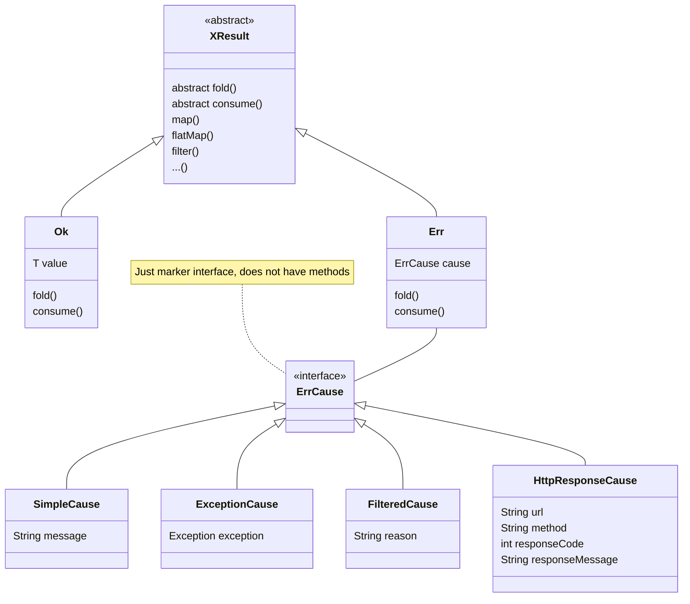

# java-extended-result-monad
Extended result monad for java

```mermaid
classDiagram
    XResult <|-- Ok
    XResult <|-- Err
    Err -- ErrCause
    
    ErrCause <|-- SimpleCause
    ErrCause <|-- ExceptionCause
    ErrCause <|-- FilteredCause
    ErrCause <|-- HttpResponseCause

    note for ErrCause "Just marker interface, does not have methods"

    class XResult~T~ {
        <<abstract>>
        abstract fold()
        abstract consume()
        map()
        flatMap()
        filter()
        ...()

    }
    
    class Ok ~T~ {
      T value
      fold()
      consume()
    }
    
    class Err{
      ErrCause cause
      fold()
      consume()
    }

    class ErrCause{
        <<interface>>
    }

    class SimpleCause{
        String message
    }

    class ExceptionCause {
        Exception exception
    }

    class FilteredCause {
        String reason
    }

    class HttpResponseCause {
        String url
        String method
        int responseCode
        String responseMessage
    }
```