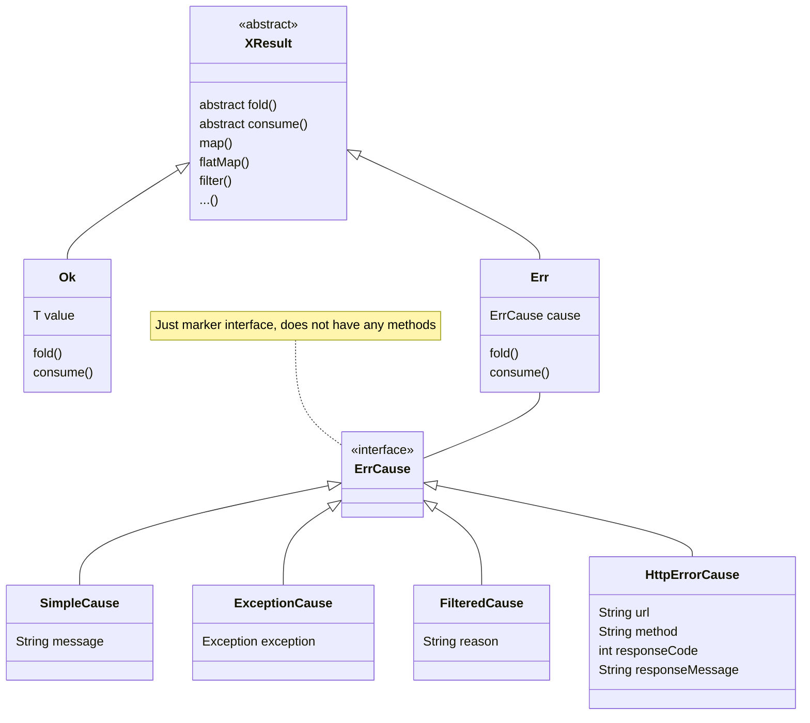

# java-extended-result-monad
Extended result monad for java

## Мотивация

TODO

## Проблема

В функциональнои программировании (далее FP) традиционно существует три монады для 
обработки/представления отказов (errors).
- `Option<T>/Maybe<T>` - для представления отсутствующего результата (null значение)
- `Result<T>/Try<T>` - для обработки случаев когда получение результата может завершиться исключением (exception)
- `Either<L,R>` - для всех остальных случае. Левое значение L традиционно ассоциируется с отказом,
правое R - c успешным результатом.

В Java Result и Either монады отсутствуют в составе стандартной библиотеки, Optional появился 
в Java8, однако его дизайн не идеален и часто критикуется, 
[для примера тут, в Oracle Java Magazine ](https://blogs.oracle.com/javamagazine/post/optional-class-null-pointer-drawbacks)

Лично меня в Optional не устраивает то, что трудно установить место возниковения null при
использованиии нескольких операций `map()` и непонятно какой фильтр сработал при использовании
нескольких операций `filter()`. Иными словами, Optional не сохраняет контекста при возникновении проблемы.
Ну да ладно, не будем слишком придираться.

Следующей общей проблемой в Java для всех монад является то, что они плохо сочетаются (compose),
а точнее совсем не сочетаются при помощи стандартной операции `flatMap()`. 
Для примера, попробуйте скомбинировать Optional и Result. Без использования `isPresent()`
и `isSuccess()` у вас это не получится, что делает использование FP в данном случае сомнительным. 

Далее, в реальной жизни возможностей Optional и Result часто бывает недостоточно. Рассмотрим
пример простой классической  функции

```java
public User getUserById(long id);
```

С точки зрения FP, данная функция должна всегда возвращать одного и того же пользователя,
а на практике данная функция может
- вернуть пользователя User
- вернуть null
- выбросить Runtime исключение
- результат может зависеть от фазы Луны ;)

Представим себя на месте автора этой функции. Как сделать эту функцию безопасной? Так?

```java
public Optional<User> getUserById(long id);
```

Не пойдет, может быть выброшено исключение. Так?
```java
public Result<Optional<User>> getUserById(long id);
```

Нет, это уже слишком. Но и это еще не всё. Представим себе что мы получаем пользователя по REST API
и на HTTP запрос получили ответ с кодом из серии 400-500. То есть причиной сбоя (error cause) является 
не null значение и не исключение, а ошибка HTTP протокола. Как сделать функцию безопасной, что вернуть
в случае отказа? Ответ - монаду `XResult<T>`

## Что в имени тебе моём ...

X в имени `XResult<T>` означает
- eXtended - расширенный. XResult одновременно обладает свойствами `Option<T>`, `Result<T>`
и `Either<L,R>`
- eXtensible - расширяемый. Вы можете легко добавлять новые причины отказов (`ErrCause`) в соответствии 
с вашей предметной областью (problem domain).

Ниже на диаграмме показан дизайн монады XResult. Он прост и традиционно имеет базовый класс XResult и 
двух потомков - `Ok`, который содержит результат типа `T` и `Err`, который содержит причину отказа 
`ErrCause`. `ErrCause` - маркерный интерфейс, который не накладывает никаких обязательств для
имплементирующих этот интерфейс. XResult предоставляет три имплементации ErrCause
- `ExceptionCause` - исключение 
- `FilteredCause` - фильтрация с указанием возможной причины
- `SimpleCause` - причина сбоя которая описывается простой строкой.

Как мы видим, отсутствует `NullCause`, в котором нет особенной нужды. Вместо `NullCause` используется
`ExceptionCause` с исключением NullPointerException, которое создается в момент обнаружения null
значения (разумеется вместе с stack-trace, который позволяет обнаруживать место возникновения проблемы)



## XResult на практике

Попробуем решить указанную выше задачу получения пользователя при помощи XResult

```java
XResult<User> user = XResult.fromCallable(() -> getUserById(100));
```

Статическая функция `XResult.fromCallable()` обработает возможные исключения и нулевые результаты 
и вернет пользователя (или ошибку) упакованную в XResult. Далее с ним можно делать всё что угодно, 
как и с любой другой монадой - map(), flatMap(), filter() и др.


